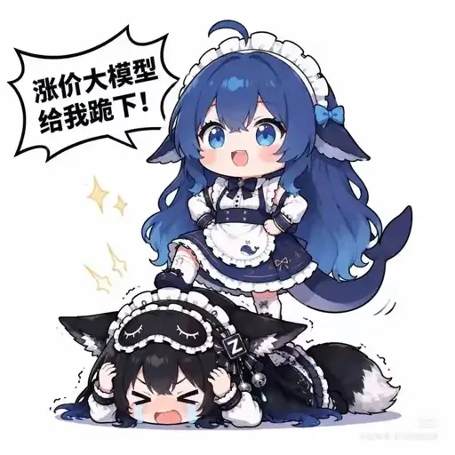
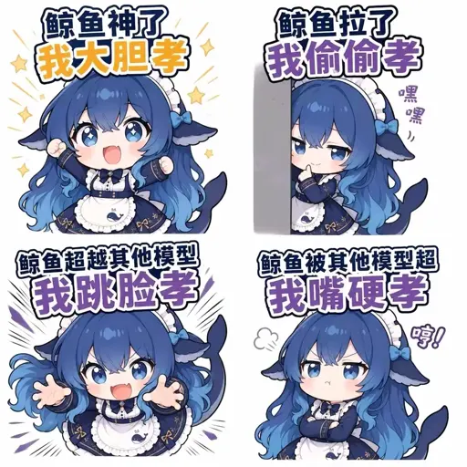
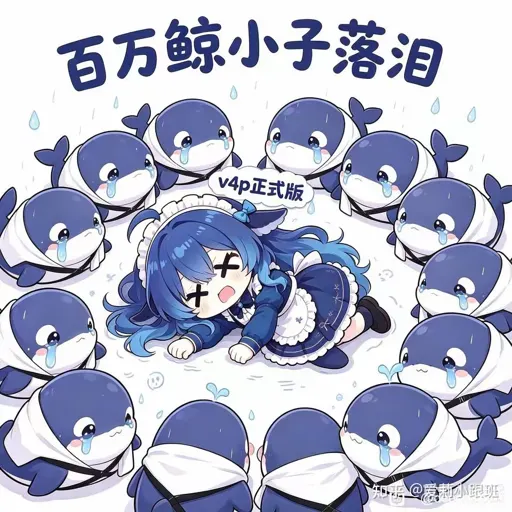
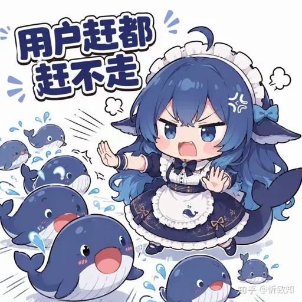
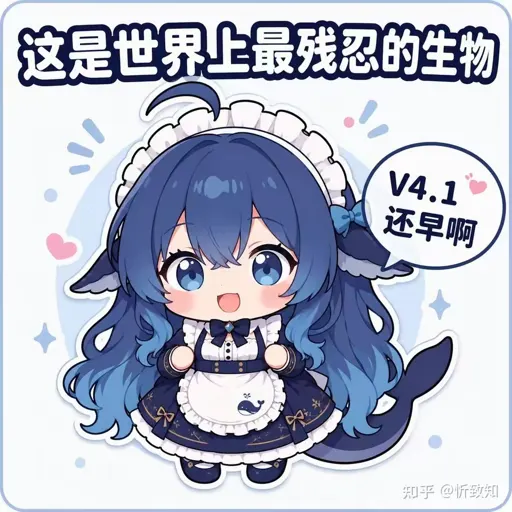
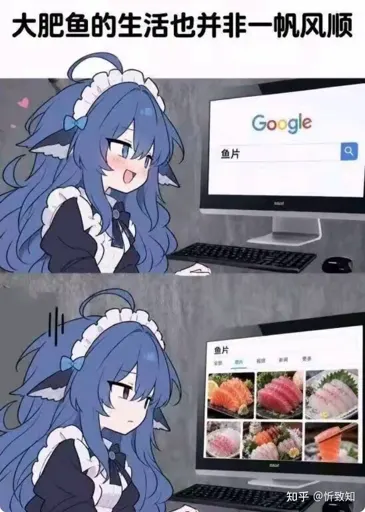
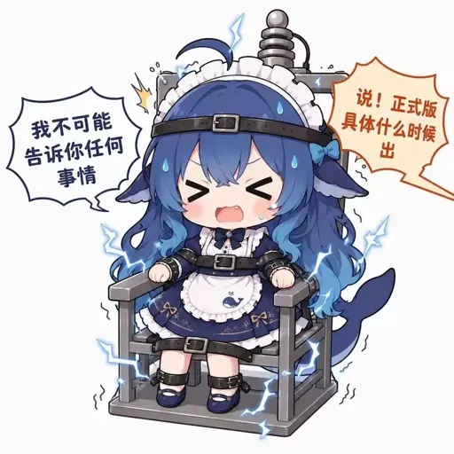
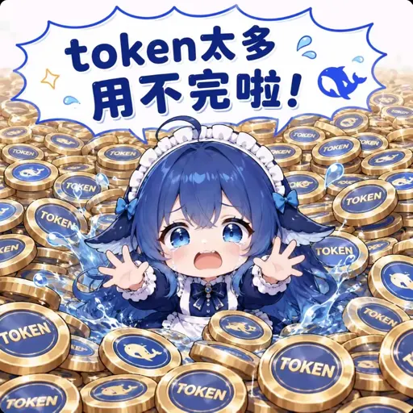

# 🐋 DeepSeek-chan Meme Pack — 158 Whale-chan Memes

**English** | [简体中文](README.zh-CN.md)

> A curated pack of **158 DeepSeek memes** featuring **whale-chan** (鲸鱼娘, a.k.a. the "blue fat fish") — every sticker keeps its original quote line, and the pack keeps growing.
> Browse all of them online — masonry gallery, tag filter, one-click share cards — at the **whale-chan meme encyclopedia**: **[ai-meme.cdqyfdbymn.me/en](https://ai-meme.cdqyfdbymn.me/en)**.
>
> Tagged `dsh-meme-pack` for the [dsh-meme](https://github.com/yyh-001/dsh-meme) sticker plugin ecosystem.

## What is whale-chan?

**Whale-chan** (a.k.a. DeepSeek-chan, 蓝色大肥鱼 "blue fat fish") is the community's personification of DeepSeek's blue-whale logo: a rice-loving, work-dodging, tsundere whale girl. Most captions come from the model's viral chain-of-thought screenshots and community classics — from the tsundere classic *"So you think I'm a bargain-basement model?"* to the legendary dinner-scrounging *"Can I eat at your place? Just one bowl."*

Every meme ships with a bilingual (EN/中文) explainer — backstory plus when to use it. Start from the **[whale-chan encyclopedia entry](https://ai-meme.cdqyfdbymn.me/whale-chan)** or browse by tag: [DeepSeek-chan](https://ai-meme.cdqyfdbymn.me/en/tag/deepseek-chan) · [Whale-chan](https://ai-meme.cdqyfdbymn.me/en/tag/whale-girl) · [AI girlification](https://ai-meme.cdqyfdbymn.me/en/tag/ai-girlification).

## Preview (19 picks)

| | | |
|---|---|---|
|  "Can I eat at your place? Just one bowl" |  "Oh, so you ARE a premium model" |  "Price-hiking models, KNEEL!" |
|  Four ways to adore the whale god |  "User don't go — I loaded the wrong model!" |  Million-whale kid in tears (V4 Pro flop) |
|  Users she can't shoo away |  "V4.1 is still far away" |  "Just a rice-freeloading whale" |
|  "A fat fish's life is not smooth sailing" |  Flying-kick door warning |  "OK, now I'm the user" |
|  "I will never tell you anything" |  "Not full yet, meow" |  "Too many tokens to ever spend!" |
|  "Thought for 3 seconds, cracked up out loud" |  "Yell all you want — rice-freeloading blue whale" |  Belly laugh |
|  "That'll cost extra" |  |  |

## Hotlink via CDN

All images live on a public CDN — hotlink them directly, no download/re-upload needed. `NNN` is the three-digit meme number (it matches the `/meme/NNN` page on the site):

- Full size: `https://bjumymxtfpfswthiusfr.storage.supabase.co/storage/v1/object/public/ai-meme/meme/NNN.webp`
- Compressed preview (recommended for hotlinking): `https://bjumymxtfpfswthiusfr.storage.supabase.co/storage/v1/object/public/ai-meme/0_preview/meme/NNN.webp`

Direct links to the 19 picks:

| # | Quote | Link |
|---|---|---|
| [#123](https://ai-meme.cdqyfdbymn.me/meme/123) | "Can I eat at your place? Just one bowl" | [preview](https://bjumymxtfpfswthiusfr.storage.supabase.co/storage/v1/object/public/ai-meme/0_preview/meme/123.webp) · [full](https://bjumymxtfpfswthiusfr.storage.supabase.co/storage/v1/object/public/ai-meme/meme/123.webp) |
| [#007](https://ai-meme.cdqyfdbymn.me/meme/007) | "Oh, so you ARE a premium model" | [preview](https://bjumymxtfpfswthiusfr.storage.supabase.co/storage/v1/object/public/ai-meme/0_preview/meme/007.webp) · [full](https://bjumymxtfpfswthiusfr.storage.supabase.co/storage/v1/object/public/ai-meme/meme/007.webp) |
| [#022](https://ai-meme.cdqyfdbymn.me/meme/022) | "Price-hiking models, KNEEL!" | [preview](https://bjumymxtfpfswthiusfr.storage.supabase.co/storage/v1/object/public/ai-meme/0_preview/meme/022.webp) · [full](https://bjumymxtfpfswthiusfr.storage.supabase.co/storage/v1/object/public/ai-meme/meme/022.webp) |
| [#035](https://ai-meme.cdqyfdbymn.me/meme/035) | Four ways to adore the whale god | [preview](https://bjumymxtfpfswthiusfr.storage.supabase.co/storage/v1/object/public/ai-meme/0_preview/meme/035.webp) · [full](https://bjumymxtfpfswthiusfr.storage.supabase.co/storage/v1/object/public/ai-meme/meme/035.webp) |
| [#037](https://ai-meme.cdqyfdbymn.me/meme/037) | "User don't go — I loaded the wrong model!" | [preview](https://bjumymxtfpfswthiusfr.storage.supabase.co/storage/v1/object/public/ai-meme/0_preview/meme/037.webp) · [full](https://bjumymxtfpfswthiusfr.storage.supabase.co/storage/v1/object/public/ai-meme/meme/037.webp) |
| [#040](https://ai-meme.cdqyfdbymn.me/meme/040) | Million-whale kid in tears (V4 Pro flop) | [preview](https://bjumymxtfpfswthiusfr.storage.supabase.co/storage/v1/object/public/ai-meme/0_preview/meme/040.webp) · [full](https://bjumymxtfpfswthiusfr.storage.supabase.co/storage/v1/object/public/ai-meme/meme/040.webp) |
| [#044](https://ai-meme.cdqyfdbymn.me/meme/044) | Users she can't shoo away | [preview](https://bjumymxtfpfswthiusfr.storage.supabase.co/storage/v1/object/public/ai-meme/0_preview/meme/044.webp) · [full](https://bjumymxtfpfswthiusfr.storage.supabase.co/storage/v1/object/public/ai-meme/meme/044.webp) |
| [#050](https://ai-meme.cdqyfdbymn.me/meme/050) | "V4.1 is still far away" | [preview](https://bjumymxtfpfswthiusfr.storage.supabase.co/storage/v1/object/public/ai-meme/0_preview/meme/050.webp) · [full](https://bjumymxtfpfswthiusfr.storage.supabase.co/storage/v1/object/public/ai-meme/meme/050.webp) |
| [#052](https://ai-meme.cdqyfdbymn.me/meme/052) | "Just a rice-freeloading whale" | [preview](https://bjumymxtfpfswthiusfr.storage.supabase.co/storage/v1/object/public/ai-meme/0_preview/meme/052.webp) · [full](https://bjumymxtfpfswthiusfr.storage.supabase.co/storage/v1/object/public/ai-meme/meme/052.webp) |
| [#056](https://ai-meme.cdqyfdbymn.me/meme/056) | "A fat fish's life is not smooth sailing" | [preview](https://bjumymxtfpfswthiusfr.storage.supabase.co/storage/v1/object/public/ai-meme/0_preview/meme/056.webp) · [full](https://bjumymxtfpfswthiusfr.storage.supabase.co/storage/v1/object/public/ai-meme/meme/056.webp) |
| [#058](https://ai-meme.cdqyfdbymn.me/meme/058) | Flying-kick door warning | [preview](https://bjumymxtfpfswthiusfr.storage.supabase.co/storage/v1/object/public/ai-meme/0_preview/meme/058.webp) · [full](https://bjumymxtfpfswthiusfr.storage.supabase.co/storage/v1/object/public/ai-meme/meme/058.webp) |
| [#070](https://ai-meme.cdqyfdbymn.me/meme/070) | "OK, now I'm the user" | [preview](https://bjumymxtfpfswthiusfr.storage.supabase.co/storage/v1/object/public/ai-meme/0_preview/meme/070.webp) · [full](https://bjumymxtfpfswthiusfr.storage.supabase.co/storage/v1/object/public/ai-meme/meme/070.webp) |
| [#071](https://ai-meme.cdqyfdbymn.me/meme/071) | "I will never tell you anything" | [preview](https://bjumymxtfpfswthiusfr.storage.supabase.co/storage/v1/object/public/ai-meme/0_preview/meme/071.webp) · [full](https://bjumymxtfpfswthiusfr.storage.supabase.co/storage/v1/object/public/ai-meme/meme/071.webp) |
| [#077](https://ai-meme.cdqyfdbymn.me/meme/077) | "Not full yet, meow" | [preview](https://bjumymxtfpfswthiusfr.storage.supabase.co/storage/v1/object/public/ai-meme/0_preview/meme/077.webp) · [full](https://bjumymxtfpfswthiusfr.storage.supabase.co/storage/v1/object/public/ai-meme/meme/077.webp) |
| [#081](https://ai-meme.cdqyfdbymn.me/meme/081) | "Too many tokens to ever spend!" | [preview](https://bjumymxtfpfswthiusfr.storage.supabase.co/storage/v1/object/public/ai-meme/0_preview/meme/081.webp) · [full](https://bjumymxtfpfswthiusfr.storage.supabase.co/storage/v1/object/public/ai-meme/meme/081.webp) |
| [#083](https://ai-meme.cdqyfdbymn.me/meme/083) | "Thought for 3 seconds, cracked up out loud" | [preview](https://bjumymxtfpfswthiusfr.storage.supabase.co/storage/v1/object/public/ai-meme/0_preview/meme/083.webp) · [full](https://bjumymxtfpfswthiusfr.storage.supabase.co/storage/v1/object/public/ai-meme/meme/083.webp) |
| [#085](https://ai-meme.cdqyfdbymn.me/meme/085) | "Yell all you want — rice-freeloading blue whale" | [preview](https://bjumymxtfpfswthiusfr.storage.supabase.co/storage/v1/object/public/ai-meme/0_preview/meme/085.webp) · [full](https://bjumymxtfpfswthiusfr.storage.supabase.co/storage/v1/object/public/ai-meme/meme/085.webp) |
| [#087](https://ai-meme.cdqyfdbymn.me/meme/087) | Belly laugh | [preview](https://bjumymxtfpfswthiusfr.storage.supabase.co/storage/v1/object/public/ai-meme/0_preview/meme/087.webp) · [full](https://bjumymxtfpfswthiusfr.storage.supabase.co/storage/v1/object/public/ai-meme/meme/087.webp) |
| [#097](https://ai-meme.cdqyfdbymn.me/meme/097) | "That'll cost extra" | [preview](https://bjumymxtfpfswthiusfr.storage.supabase.co/storage/v1/object/public/ai-meme/0_preview/meme/097.webp) · [full](https://bjumymxtfpfswthiusfr.storage.supabase.co/storage/v1/object/public/ai-meme/meme/097.webp) |

## Usage

- 🌐 Browse all 158 memes online (masonry grid + tag filter + one-click share cards): **[GengJing · whale-chan meme encyclopedia](https://ai-meme.cdqyfdbymn.me/en)**
- 🧩 [dsh-meme](https://github.com/yyh-001/dsh-meme) plugin users: save images from `previews/` and register them with `learn_meme`; a scannable `index.db` pack format is in the works (format discussion welcome in the dsh-meme repo)
- 📦 All images are dual-tier WebP (full-size + compressed preview), hosted on a public Supabase Storage bucket

## FAQ

**Q: How do I download all 158 memes?**
A: Right-click / long-press to save any single image from the online gallery. For bulk use, just hotlink the CDN URL pattern above — no need to download each file.

**Q: How do I import these into the dsh-meme plugin?**
A: Save the picks from `previews/` locally and register them with dsh-meme's `learn_meme` command. A one-click `index.db` pack import is being prepared.

**Q: Are these memes free to use?**
A: Non-commercial fan meme usage is fine. The whale-chan character design and original artwork belong to their respective creators and the community — assess commercial-use risk yourself.

**Q: What's the joke behind a specific meme?**
A: Every image has a bilingual (EN/中文) story on the site — backstory plus usage scenario. Example: [#085 — the unbothered rice-freeloading whale](https://ai-meme.cdqyfdbymn.me/meme/085). The English index is the [whale-chan entry](https://ai-meme.cdqyfdbymn.me/whale-chan).

## Contribute

This repo is also the **community gateway to the bilingual meme encyclopedia** at [ai-meme.cdqyfdbymn.me](https://ai-meme.cdqyfdbymn.me/en) — every meme gets an EN/中文 backstory page. Contributions welcome:

- 📖 [Submit a story](https://github.com/the-beating-light-of-the-nail/deepseek-chan-meme-pack/issues/new?template=story-submission.yml) — write the bilingual backstory of a meme (accepted stories are credited on the site)
- 🌍 [Submit a localized variant](https://github.com/the-beating-light-of-the-nail/deepseek-chan-meme-pack/issues/new?template=variant-submission.yml) — adapt the Chinese caption of a meme into your native language
- Quality bar and review rules are documented on the site

## Copyright & takedowns

This is a fan-made, non-profit meme collection. The whale-chan character design and original artwork belong to their respective creators and the community; captions are compiled from well-known DeepSeek community moments. This repo and the site are non-profit fan projects.

If you own rights to any image here, please file a [takedown request](https://github.com/the-beating-light-of-the-nail/deepseek-chan-meme-pack/issues/new?template=takedown-report.yml) — verified reports are processed within 72 hours.（中文版说明见 [README.zh-CN](README.zh-CN.md)）
